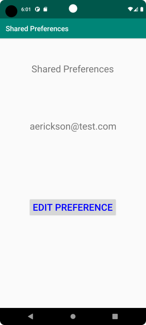

# Rapport

**Shared preferences**

För att lösa denna uppgift har jag skapat ett program med två Activities, som har en gemensam inställning. Inställningen redigeras i den ena aktiviteten och visas i den andra. 

------
|


Huvudaktivitetens layout definieras i activity_main.xml och består av en constraintlayout ett verktygsfält, två textvyer och en knapp. Redigeringsaktivitetens layout definieras i edit_pref.xml och består av en linjär layout, en textvy, ett redigeringsfält och en knapp.

Huvudaktiviteten initieras i onCreate(), där skapas referenser till verktygsfältet, knappen och textvyn som visar den delade preferensen med hjälp av findViewById(). Textvyn som visar en rubrik refereras aldrig till i koden så den behöver vi ingen referens till. Vi skapar även ett objekt av typen SharedPreferences som vi referar till med variabeln settings.

```
@Override
protected void onCreate(Bundle savedInstanceState) {
    super.onCreate(savedInstanceState);
    setContentView(R.layout.activity_main);
    Toolbar toolbar = findViewById(R.id.toolbar); //read in toolbar
    setSupportActionBar(toolbar);
    switchActivityButton = findViewById(R.id.switch_acitivity_button); //read in button
    showPref = findViewById(R.id.show_pref); //read in textview to show preference

    settings = getSharedPreferences("shared_prefs", MODE_PRIVATE); // get object of type  SharedPreferences
}
```

För att komma till redigerings aktiviteten klickar man på knappen "EDIT PREFERENCE", vi behöver därmed en händelsehanterare som skapar en ny aktivitet när vi klickar på den. Denna händelsehanterare, som registreras i layoutfilen för  aktiviteten, utgörs av onClickListerner(View v). Dess enda uppgift är att start aktiviteten, som synes så skickas ingen information med till den nyskapade aktiviteten. 

```
/* clicklistener for switchActivityButton, creates new activity where 
 * preference editing happens
 */
 
public void onClickListener(View v) {
    startActivity(new Intent(this, EditPreferenceActivity.class));
}
```

Den nya aktiviteten initieras i sin egen version av onCreate(). I denna så skapas en referens till ett EditText-fält med hjälp av findViewById(). Vi skapar även ett objekt av typen SharedPreferences och SharedPreferences.Editor för att kunna redigera inställningen. 

```
@Override
protected void onCreate(Bundle savedInstanceState) {
    super.onCreate(savedInstanceState);
    setContentView(R.layout.edit_pref);

    field = findViewById(R.id.edit_field);
    preferences = getSharedPreferences("shared_prefs", MODE_PRIVATE); //get a reference to the shared preferences
    preferenceEditor = preferences.edit(); // get an preference editor object

}
```

Som synes ovan så har vi en knapp för att spara inställningen efter att ett värde har matats in i redigeringsfältet. Knappen referas ej till i koden, så vi behöver inte skapa någon referens till den med findViewById(). Dock måste en händelsehanterare som avgör vad som händer då man klickar på knappen definieras. I layouten för denna aktivitet så registrerades händelsehanteraren onClickListener() för knappen. Det vi behöver göra i denna är att läsa innehållet i redigeringsfältet, skriva detta värde till programmets delade inställningar tillsammans med nyckeln "email". Därefter applicerar vi ändringen genom att anropa apply() varefter vi avslutar aktiviteten. 

```
public void onClickListener(View v) {
    String fieldText = field.getText().toString(); //get string from EditText field
    Log.d("EditActivity:onClickListener", fieldText);
    preferenceEditor.putString("email", fieldText);//write this string together with key "email"
    preferenceEditor.apply(); //apply the updated preference
    finish(); //exit activity
}
```

När vi nu kommer tillbaka till huvudaktiviten så kommer onResume() anropas. Här hämtar vi värdet som har lagrats i de gemensamma inställningarna under nyckel "email" med ett anrop till getString(). Därefter så updaterar vi textvyn som visar den gemensamma inställningen med detta värde. 

```
protected void onResume() {
    super.onResume();

    String emailSetting = settings.getString("email", "email preference isn't set"); // get value stored with key "email"
    showPref.setText(emailSetting); // set the new value in the textview
}
```
Därefter kommer detta nya värde visas i textvyn som synes nedan.



